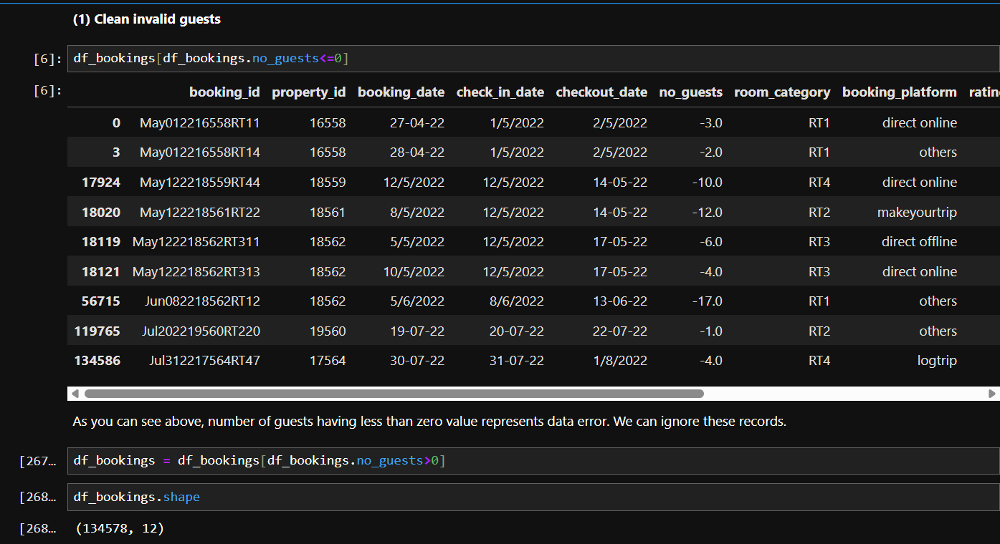
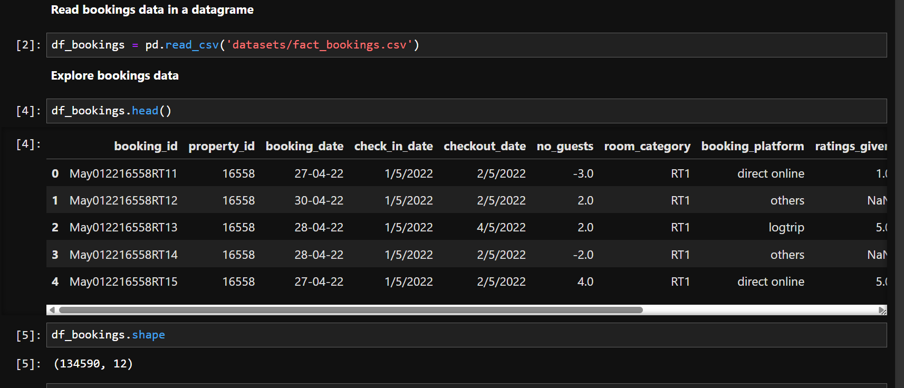
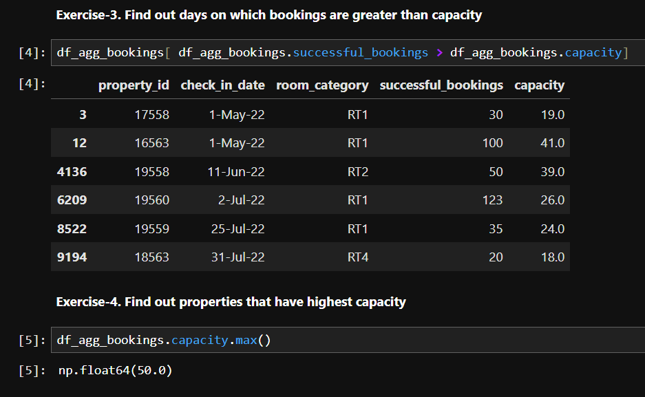
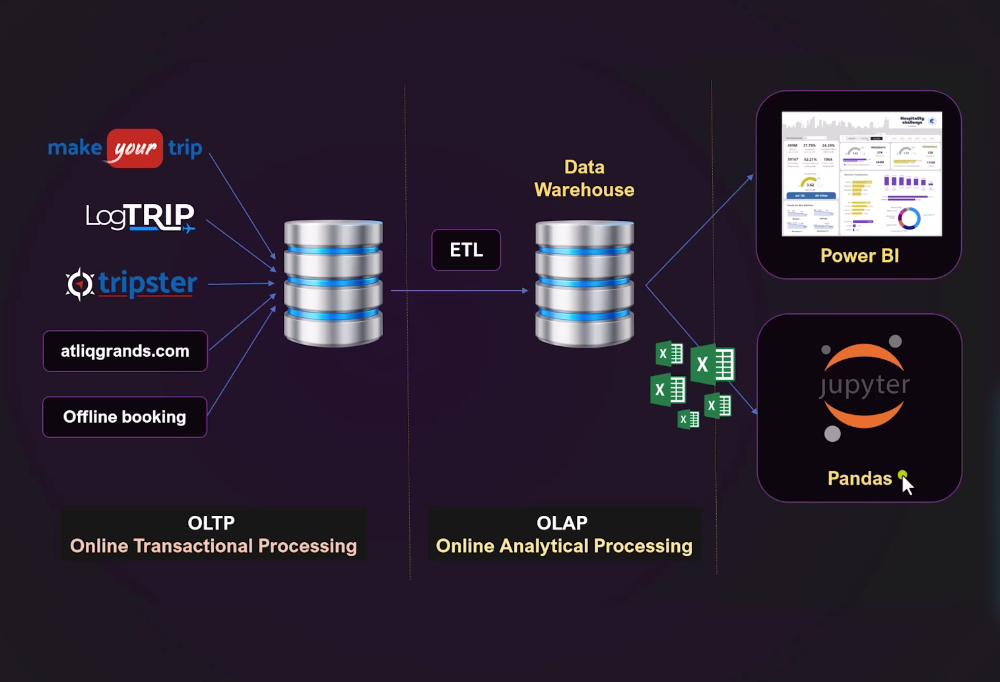

# 🏨 Hotel Booking Data Analysis – AtliQ Grands

 <!-- Replace with your actual screenshot -->

> 📊 A Python-based data analysis project that uncovers hotel booking trends, helping AtliQ Grands boost occupancy and revenue using real-world data.

---

## 🧩 Problem Statement

AtliQ Grands is facing a **decline in bookings and revenue** but lacks an in-house analytics team. This project analyzes hotel data to uncover **actionable insights** and support better decision-making.

---

## 🎯 Objectives

- Analyze booking trends across cities and room types  
- Compare weekday vs weekend performance  
- Suggest improvements to increase revenue and occupancy  

---

## 🛠️ Tools & Libraries Used

| Tool             | Use Case                         |
|------------------|----------------------------------|
| `Python`         | For scripting and logic          |
| `Jupyter Notebook` | Step-by-step analysis workflow  |
| `Pandas`         | Data cleaning and manipulation   |
| `Matplotlib & Seaborn` *(if used)* | Visualization of key metrics |

---

## 📂 Datasets Used

All datasets are available in the `/datasets` folder:

- `Bookings` – Reservation details  
- `Room Types` – Information on different room categories  
- `Cities` – Hotel locations  
- `Booking Dates` – Dates of check-in and check-out  
- `Revenue` – Financial data

📝 *Each dataset was cleaned, merged, and analyzed in Jupyter Notebook.*

---

## 🔍 Data Analysis Steps

1. **Data Cleaning & Transformation**  
   - Handled duplicates, missing values  
   - Standardized date formats and merged datasets
  
   - 

   - 

3. **Exploration & Visualization**  
   - Analyzed occupancy by city and room type  
   - Compared weekday vs weekend performance  
   - Calculated revenue across cities
  
   - 

4. **Key Insights Generated**  
   - Identified best/worst performing rooms and cities  
   - Highlighted peak times for bookings  
   - Found opportunities for improvement
  
   - 

---

## 🔄 Data Pipeline

The flow of data from booking platforms to analysis:

1. Data comes from sources like MakeMyTrip, Tripster, AtliQGrands.com & offline bookings  
2. Goes through ETL process  
3. Stored in a Data Warehouse  
4. Analyzed in Jupyter using Pandas

---

## 📈 Key Insights

| Category   | Insight |
|------------|---------|
| 🔹 Occupancy | Presidential Rooms had the highest occupancy (59.28%)   Delhi had the best city occupancy (61.51%)   Weekends had 72.34% occupancy vs 50.88% on weekdays |
| 🔹 Revenue   | Mumbai generated the highest revenue – ₹668.57M   Delhi generated the lowest – ₹294.40M |

---

## ✅ Recommendations

- Focus more marketing on **Delhi** and **Presidential Rooms**  
- Launch **weekend travel packages** to capture high demand  
- Offer **discounts in Bangalore** to boost occupancy  
- Partner with **online platforms** to expand booking reach  

---

---

## 💬 Conclusion

This Python-based analysis provided AtliQ Grands with:

- Clear visibility into hotel performance  
- Data-backed strategies to improve revenue  
- Actionable insights to stay competitive  

---

## 🙋‍♀️ Author

**Namrata Patel**  
📫 [LinkedIn](https://www.linkedin.com/in/namrata-patel-9027) | 🌐 [GitHub](https://github.com/Namratapatel9027)  | 📽️ [Youtube](https://www.youtube.com/@kpcodeventure)

---

⭐ *If you found this useful, don’t forget to star the repo!*

